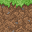

# TEXTURE PACK KOSONGAN



### A.) Apa itu Texture Pack Kosongan

Texture Pack Kosongan adalah texture pack mentahan yang bisa kalian buat untuk membuat texture pack apapun,nah karena isi texture pack ini kosong
jadi kalian harus menambahkan texture-texture block,item,gui,dll dari luar ke sini secara mandiri

Texture ini dibuat untuk mempermudah kalian dalam proses pembuatan dan pengembangan texture pack. Semoga ini bisa bermanfaat kepada kalian semua

### B.) Cara Pakai Texture Pack Ini

1. Pertama download file ini terlebih dahulu.
2. Kedua ekstrak file zip tersebut
3. Sebelum melakukan proses pembuatan texture pack, jangan lupa edit **manifest.json** terlebih dahulu, mulai dari:

   - `name` (nama texturemu)
     Contoh : `"name": "Texture Pack Kosongan",`

   - `description ` (deskripsi texturemu)
     Contoh : `"description": "Deskripsi Texture Kamu. \nCreator : Nama Kamu",`
     Deskripsi singkat tentang texture mu, kalo mau nambahin baris baru/enter cukup tambahkan `\n` Seperti `\nCreator : Nama Kamu \nYT : Nama Channel YT Kamu \nIG : Nama IG Kamu`
     Hasilnya Seperti ini (Jika ditampilan di Minecraft kamu):
     ```
     Creator : Nama Kamu
     YT : Nama Channel YT Kamu
     IG : Nama IG Kamu
     ```

   - `version` (versi texture pack,opsional)
     Contoh : `"version": [0, 0, 1],`
     Kalau ini sih, bebas mau kamu tulis versi berapa :V

   - `min_engine_version` (Versi Minecraft Yang Dibutuhkan Agar Texture Packmu Work/bisa dipakai)
     Contoh : `"min_engine_version": [ 1, 18, 10 ]`
     Maksud dari kode diatas adalah versi Minecraft yang kompatibel/mendukung/support texture pack ini adalah minimal versi `1.18.10`.

   - `UUID` (Wajib Diganti Dulu, supaya supaya tidak terjadi sesuatu yang tidak kamu inginkan seperti error karena terdeteksi **"duplikated pack"**, kamu bisa mencari kode dan mengganti kode uuid dengan mudah lewat website [UUID Generator](https://www.uuidgenerator.net/))
     Contoh : `"uuid": "66c6e9a8-3093-462a-9c36-dbb052165822",`

   Kurang lebih isi source code **manifest.json** seperti dibawah ini

   ```javascript
   {
       "format_version": 2,
       "header": {
           "description": "Deskripsi Texture Kamu. \nCreator : Nama Kamu",
           "name": "Texture Pack Kosongan",
           "uuid": "66c6e9a8-3093-462a-9c36-dbb052165822",
           "version": [0, 0, 1],
           "min_engine_version": [ 1, 18, 10 ]
       },
       "modules": [
           {
               "description": "Deskripsi Texture Kamu. \nCreator : Nama Kamu",
               "type": "resources",
               "uuid": "743f6949-53be-44b6-b326-398005028819",
               "version": [0, 0, 1]
           }
       ]
   }
   ```
4. Jangan lupa ubah UUID yang ada di manifest.json,supaya tidak terjadi sesuatu yang tidak kamu inginkan seperti error karena terdeteksi **"duplikated pack"**, kamu bisa mencari kode dan mengganti kode uuid dengan mudah lewat website [UUID Generator](https://www.uuidgenerator.net/)
5. Karena texture ini kosong,jadi kamu harus menambahkan texture-texture dari luar ke dalam texture ini (aku anggap kalian sudah tau hehehe :v)
6. Jangan lupa subscribe AhZanMC :V

### C.) Download
Kalo mau download, [klik disini](https://www.mediafire.com/file/rvzsojsvl0tmove/Texture_Pack_Kosongan.zip/file)

### E.) Penutup

Selamat membuat dan mengembangkan Texture buatanmu sendiri dan semoga berhasil :)

Creator : AhZanMC

Youtube : [Klik Disini](https://www.youtube.com/c/AhZanMC)

Instagram : [Klik Disini](https://www.instagram.com/ahzanmc/)

Github : [Klik Disini](https://github.com/AhZanMC)

Website : [Klik Disini](https://ahzanmc.my.id/)
